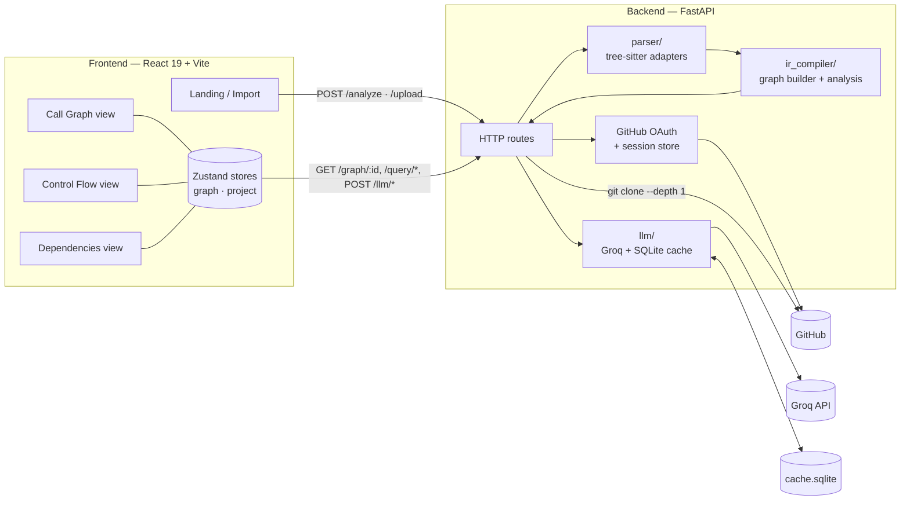
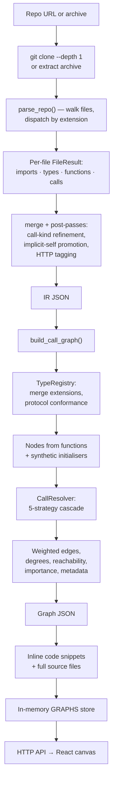
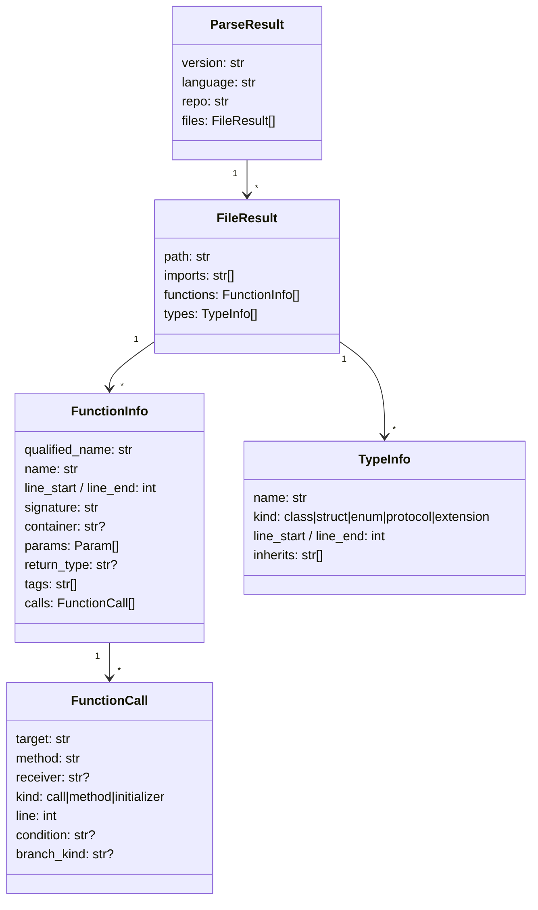
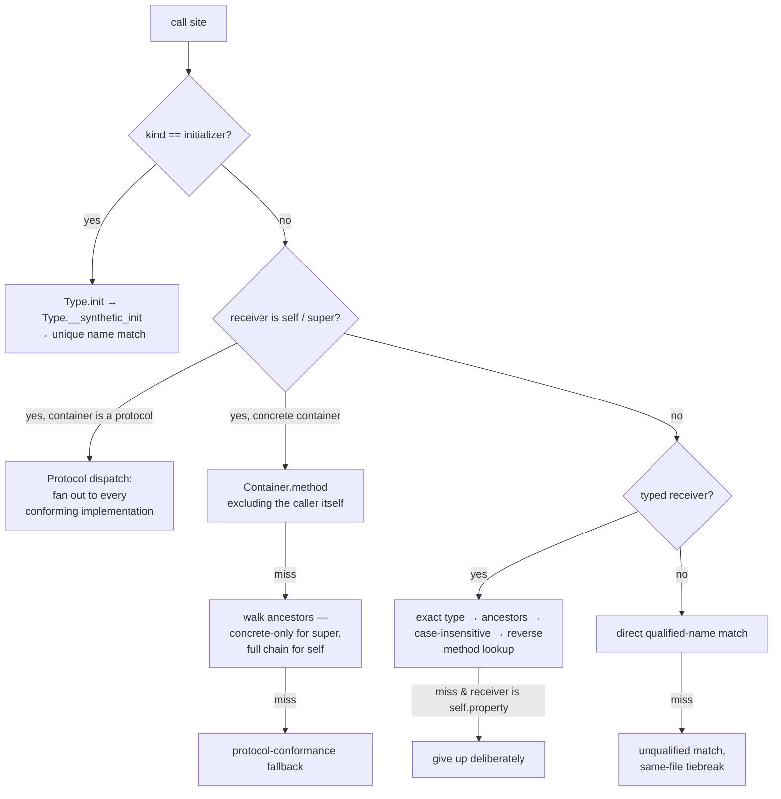
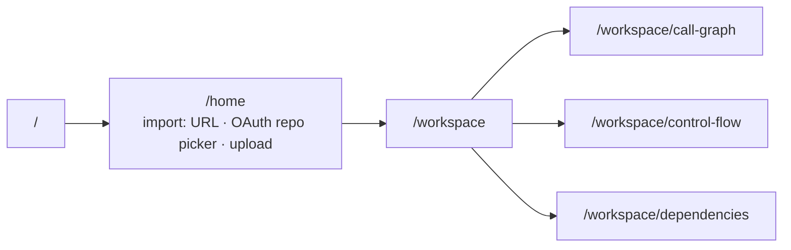

# Synapsis

**An AST-based call-graph explorer for unfamiliar codebases.**

Point it at a repository. Synapsis clones it, parses every source file with tree-sitter, resolves each call site to the function it actually reaches, and renders the result as an interactive graph you can zoom from architecture level down to a single call. Click any function to read its source, ask an LLM what it does, or ask what breaks if you change it.

The frontend is branded **Synapse**; the backend package, API and deployment config use **Synapsis**. Same project.

---

## Table of contents

- [What it does](#what-it-does)
- [Architecture](#architecture)
- [The pipeline, stage by stage](#the-pipeline-stage-by-stage)
  - [1. Ingest](#1-ingest)
  - [2. Parse — source to IR](#2-parse--source-to-ir)
  - [3. Compile — IR to call graph](#3-compile--ir-to-call-graph)
  - [4. Analyse — queries over the graph](#4-analyse--queries-over-the-graph)
  - [5. Explain — the LLM layer](#5-explain--the-llm-layer)
- [The frontend](#the-frontend)
- [API reference](#api-reference)
- [Running locally](#running-locally)
- [Configuration](#configuration)
- [Project layout](#project-layout)
- [Tests](#tests)
- [Deployment](#deployment)
- [Known gaps](#known-gaps)

---

## What it does

| Capability | How it works |
|---|---|
| **Import a codebase** | GitHub URL (public, or private via OAuth), an uploaded `.zip`/`.tar`/`.tar.gz`, a dropped folder, or a single source file |
| **Multi-language parsing** | tree-sitter adapters behind a registry — Swift, Python, JavaScript/JSX today, new languages drop in as a class |
| **Real call resolution** | Not name matching: a type registry merges extensions, tracks protocol conformance and inheritance, then resolves `self.`/`super.`/typed-receiver/initializer calls through a five-strategy cascade |
| **Interactive graph** | Custom SVG canvas with dagre layout, viewport culling, per-view camera and layout caches, animated tweens between every state |
| **Package view + drill-down** | Louvain community detection groups containers into mega-groups; drill mega → container → functions, with *port nodes* standing in for connections that leave the current scope |
| **Deterministic insight** | Hotspots, dead code, blast-radius impact prediction, module dependency layers, per-node importance — all computed in Python, zero LLM calls |
| **AI explanation** | Groq (Llama 3.3 70B) explains a single function, summarises the whole codebase, narrates a change's risk, or answers free-form questions with the graph as context |
| **Response cache** | Every LLM call is keyed by a content signature and cached in SQLite, so re-asking is free and instant |
| **Filtering** | 14 server-side node filters (category, kind, access level, container, degree ranges, …) plus a client-side importance threshold slider |

---

## Architecture



**Stack**

| Layer | Choice |
|---|---|
| Frontend | React 19, Vite 8, Tailwind v4, JavaScript |
| Graph rendering | Hand-rolled SVG canvas + `dagre` for ranked layout |
| Frontend state | Zustand (`graphStore`, `projectStore`) |
| Backend | FastAPI (Python 3.12), uvicorn |
| Parsing | `tree-sitter` 0.25 + `tree-sitter-swift`, `-python`, `-javascript` |
| Community detection | `networkx` Louvain |
| LLM | Groq `llama-3.3-70b-versatile` via the OpenAI-compatible SDK |
| Cache | SQLite (`llm_cache` table) |
| Storage | None — graphs live in process memory, repos in temp dirs that are deleted after parsing |

---

## The pipeline, stage by stage



### 1. Ingest

`POST /analyze` takes a GitHub URL, derives a stable `graph_id` from the repo name, and shallow-clones into a temp directory. If the caller has a GitHub session cookie, the token is passed through `GIT_ASKPASS` rather than being embedded in the clone URL, so it never appears in `argv` or a process listing — and it is scrubbed from any error text before that text reaches the client.

Because cloning and parsing a real repo takes a while, the route publishes progress into a `JOBS` dict as it moves through `cloning → parsing → building → snippets → ready`. The frontend polls `GET /progress?repo_url=…` every 600 ms and drives a progress bar from it.

`POST /upload` covers the offline path: a `.zip`/`.tar`/`.tar.gz`, or a single source file. The browser can also bundle a dropped or picked *folder* into a zip client-side with JSZip, skipping `node_modules`, `.git`, `dist`, `venv` and friends before upload.

Either way, the temp directory is removed in a `finally` block — but not before two things are lifted out of it: a **code snippet** per node (a few lines before the definition, ~25 after) and the **full text of every file** that contains at least one node, stored on the graph as `source_files`. That is what lets the UI show real source with no filesystem access afterwards.

### 2. Parse — source to IR

Parsing is a registry of adapters. A parser class declares its language and extensions and registers itself with a decorator:

```python
@register
class PythonParser(BaseParser):
    @property
    def language(self) -> str: return "python"
    @property
    def extensions(self) -> list[str]: return [".py"]
    def parse_file(self, path: str) -> FileResult: ...
```

`parse_repo()` walks the tree, looks up a parser by file extension, skips anything unregistered, and merges every `FileResult` into one `ParseResult`. Adding a language means adding one file under `parser/langs/` — nothing downstream changes.

**Registered today:** Swift (`.swift`), Python (`.py`), JavaScript/JSX (`.js`, `.mjs`, `.cjs`, `.jsx`).

The IR is a plain dataclass tree, serialised with `asdict`:



The Swift adapter additionally tracks a **branch stack** while walking: calls inside an `if` body, a `guard`'s `else`, or a `switch` case are tagged with the governing condition text and a `branch_kind` (`if_then` / `if_else` / `guard_else` / `switch_case`).

Three post-passes run over the merged IR:

- **`_refine_call_kinds`** — the parser tags any bare PascalCase callee as an initializer, which is right for `UUID()` or `Todo()` but wrong for the XCTest assertion family. Those known globals get demoted back to plain calls.
- **`_resolve_implicit_self`** — Swift lets you call a sibling method without `self.`. If a bare call's target matches another method name in the same container, it is promoted to `kind="method"`, `receiver="self"`.
- **`_tag_http`** — functions decorated with `@app.route` / `@router.get` / `@api_view` get an `http:endpoint` tag; functions calling `fetch`/`axios`/`post`/… get `http:client`. Dead-code detection later treats both as alive by definition.

### 3. Compile — IR to call graph

`ir_compiler_v3.build_call_graph()` is where flat IR becomes a graph. The hard part is deciding what a call site actually reaches.

**Type registry.** Every declaration of a name is merged into one `UnifiedType` — a class and its five extensions become a single logical type with the union of their methods, files and inherited names. Types that appear *only* as extensions are marked `extension_only`: they're external (Foundation, third-party), so no synthetic initialiser is minted for them and calls don't resolve into them. Protocol conformance is indexed both ways, so the registry can answer "who conforms to `P`?" transitively.

**Call resolution.** `CallResolver.resolve()` runs a priority cascade:



The negative cases matter as much as the positive ones. A `self.property.method()` whose property type is invisible to us is allowed to resolve only when the single matching definition lives on a *protocol* — a concrete-class hit there is almost always a false positive, so it's dropped. Multi-segment receiver chains like `store.dispatch.then` bail out entirely. Self-loops are suppressed, because a node calling itself is nearly always overload ambiguity rather than real recursion.

**Node enrichment.** Each node carries `access_level` (parsed from the signature, defaulting to Swift's implicit `internal`), `is_override`, `protocol_witnesses` (which protocol requirements this function satisfies), a `complexity` proxy (`param_count`, `call_count`, `line_span`), `function_kind`, `category` (`source` / `test` / `util`, from the path), `tags`, in/out degree, and `reachable_from_public_api`.

**Importance.** `compute_importance()` runs a weighted PageRank (30 iterations, damping 0.85, dangling mass redistributed uniformly) and blends it 70/30 with normalised out-degree, so orchestrators with high fan-out but low fan-in still surface. Output is normalised to `[0, 1]`, which is what lets the frontend's threshold slider behave the same on a 40-node graph and a 4000-node one.

**Graph metadata.** Undirected connected components, strongly connected components via Tarjan (the UI badges every member of an SCC ≥ 2 as recursive), entry points, a test-coverage proxy from BFS reachability out of test nodes, protocol conformance counts, and per-kind/per-category breakdowns.

### 4. Analyse — queries over the graph

| Query | Algorithm |
|---|---|
| **`predict_impact`** | Bidirectional BFS from the node, capped at distance 4. Each reached node scores `1/(1+distance) × edge_weight × (1 + ln(1 + in_degree))`; top 30 returned with the path that reached them |
| **`hotspots`** | Ranking by raw in-degree is misleading — 50 calls from one test file beats 10 calls from 10 source files. Instead: count *unique* callers, weight each by category (`source` 1.0, `util` 0.5, `test` 0.25), tie-break on out-degree |
| **`dead_code`** | Seed with candidates that have no callers (excluding tests, constructors, synthetics, public/open API, and HTTP endpoints/clients), then iterate to a fixpoint: a node whose only callers are dead is itself dead |
| **`clusters`** | Group by container. If more than 15 containers, run Louvain on the container-level weighted graph to produce mega-groups; return both levels plus the container→mega map so the UI can drill |
| **`dependencies`** | Roll node edges up to container→container edges with weights, compute fan-in/fan-out, per-module test coverage, and assign topological layers by BFS from the roots |

### 5. Explain — the LLM layer

Four use cases, one provider, one cache:

- **`explain_node`** — function source + signature + complexity + caller/callee names → 3–5 sentences.
- **`codebase_overview`** — top hotspots + node/edge counts → what the library does, its architectural pattern, its entry points.
- **`impact_narrative`** — target function + ranked affected nodes → blast radius, critical paths, a risk level.
- **`chat_with_graph`** — free-form question answered against a context block built from graph metadata, hotspots, cluster labels, and the selected nodes' callers/callees/snippets.

Prompts adapt to the repo: the file extension picks the language name and code-fence tag, so a Swift repo gets "You are a senior Swift engineer" and a Python one doesn't.

Every call goes through `cached_complete()`, which hashes `(use_case, params, content_signature, provider_model)` into a SHA-256 key and checks SQLite first. The content signature is deliberately content-derived — for `explain_node` it's the signature, line span, call count and first 500 characters of source — so the cache invalidates when the *code* changes, not when an unrelated node id shifts. Responses carry a `cached` flag and a token count back to the UI.

Cluster labelling reuses the same path: `label_clusters_with_llm()` asks for a 2–4 word role label per container ("State Management", "Side Effect Engine") and attaches it as `ai_label`. It fails soft — if the LLM is unavailable, heuristic labels stay.

---

## The frontend

Three workspace views share one graph store, each with its own cached layout and camera so switching pages doesn't disturb where you were.



**Call Graph** — the main canvas. Opens in package view: clusters as cards you can expand in place or drill into. Node cards show kind icon, container colour, degrees and complexity; selecting one highlights its direct neighbours and opens the inspector. Left rail carries the file explorer, a searchable function list with chip filters (tests / throws / private / override / recursive / entry / leaf), AI overview, insights, the filter panel, and Unused/Entry/Leaf classification chips.

**Control Flow** — same canvas engine, but edges are styled by branch kind and carry condition labels drawn at the edge midpoint, so you can read *under what condition* one function calls another.

**Dependencies** — module-level view. Containers laid out by topological layer, sized by function count, coloured by test coverage, with fan-in/fan-out on each card.

Cross-cutting behaviour:

- **Drill-down with ports.** Entering a cluster hides everything outside it, but connections that cross the boundary don't vanish — they become small port nodes labelled with the external cluster and edge count, so you never lose the context of what calls in and what you call out to.
- **Animated everything.** Layout changes, cluster expand/collapse and drill transitions are `requestAnimationFrame` tweens with `easeInOutCubic`. Member nodes interpolate as offsets from their cluster card's interpolated position, so they never escape the card mid-animation.
- **Aspect balancing.** dagre's LR ranking produces tall narrow strips whenever one function fans out widely. `_balanceLayoutAspect` re-stacks over-tall ranks into sub-columns while preserving dagre's crossing-minimising order, until the bounding box reaches a target aspect ratio.
- **Performance.** Viewport culling on nodes and edges with a 300 px buffer, `React.memo` node cards with stable id-based handlers, `Map`-based edge endpoint lookup.
- **Inspector.** Source with syntax highlighting and line numbers, params, return type, enrichment chips, copy-to-clipboard, plus AI summarise and impact analysis — both revealed with a typewriter effect over a `grid-rows` height transition.
- **Filtering.** The panel posts to `/graph/{id}/filter` for the 14 server-side filters; the importance slider filters client-side with no round trip. Edges survive only when both endpoints do.

---

## API reference

Interactive docs live at `http://localhost:8000/docs` on the running server.

Most read endpoints operate on `GRAPH` — the **currently active graph**, set by the most recent `/analyze` or `/upload`. Endpoints taking an explicit `{graph_id}` read from the `GRAPHS` map instead.

### Graph lifecycle

| Method | Path | Purpose |
|---|---|---|
| `GET` | `/health` | Node/edge counts of the active graph, LLM cache entry count |
| `POST` | `/analyze` | `{repo_url, force?}` → clone, parse, build. Returns `graph_id` + counts |
| `GET` | `/progress/{graph_id}` | Live stage/percent/message for an in-flight analyse |
| `GET` | `/progress?repo_url=…` | Same, resolving the id from a GitHub URL |
| `POST` | `/upload` | multipart archive or single source file |
| `GET` | `/graph/{graph_id}` | Full graph: metadata, nodes, edges, `source_files` |
| `GET` | `/graph/{graph_id}/repo-info` | Origin URL and `owner/name` |
| `GET` | `/node/{node_id}` | One node with its callers, callees and snippet |

### Analysis

| Method | Path | Purpose |
|---|---|---|
| `POST` | `/predict-impact` | `{node_id}` → ranked affected nodes with distance, risk score, path |
| `GET` | `/query/hotspots` | Top 15 by weighted unique-caller score |
| `GET` | `/query/dead_code` | Transitively unreachable functions |
| `POST` | `/graph/{graph_id}/filter` | 14 optional filters, AND-combined; returns the induced subgraph |
| `GET` | `/graph/{graph_id}/filter-options` | Distinct values per filterable field, for populating the UI |
| `GET` | `/graph/{graph_id}/clusters?ai_labels=` | Container clusters, mega-groups, cluster edges, node→cluster map |
| `GET` | `/graph/{graph_id}/dependencies` | Module nodes with fan-in/out, coverage, layer; module edges |

### LLM

| Method | Path | Purpose |
|---|---|---|
| `POST` | `/llm/explain-node` | `{node_id}` → explanation + tokens + `cached` |
| `POST` | `/llm/overview` | Codebase summary from hotspots and counts |
| `POST` | `/llm/impact-narrative` | `{node_id}` → risk narrative over the predicted blast radius |
| `POST` | `/llm/chat` | `{question, context_node_ids?}` → graph-grounded answer (falls back to hotspots when no context given) |

### Auth

| Method | Path | Purpose |
|---|---|---|
| `GET` | `/auth/github/login` | Returns the GitHub authorize URL with a CSRF `state` |
| `GET` | `/auth/github/callback` | Exchanges the code, creates an 8-hour session, sets an `httponly` cookie, redirects to the frontend |
| `GET` | `/auth/me` | Current user, or 401 |
| `POST` | `/auth/logout` | Drops the session and clears the cookie |
| `GET` | `/auth/github/repos` | Up to 300 repos (owner, collaborator, org member) |
| `GET` | `/auth/github/last-commit?repo=owner/name` | Latest commit on the default branch — powers the "re-analyse when upstream moved" footer |

Sessions live in a process dict with an 8-hour TTL; pending OAuth states expire after 10 minutes.

---

## Running locally

Requires Python 3.12+ and Node 18+.

### Backend

```bash
cd backend
python -m venv venv
source venv/bin/activate          # Windows: venv\Scripts\activate
pip install -r ../requirements.txt

cp ../.env.example ../.env        # then set LLM_API_KEY
uvicorn api.main:app --reload --port 8000
```

- API: `http://localhost:8000`
- Swagger: `http://localhost:8000/docs`

A free Groq key comes from <https://console.groq.com/keys>. Without one the graph pipeline still works end to end — only the `/llm/*` routes fail.

On startup the server looks for a pre-built graph at `GRAPH_PATH` (default `backend/cached/katana.graph.json`) and loads it as the initial active graph. That file is gitignored, so a fresh clone starts empty — which is fine; the first `/analyze` populates everything. To rebuild it, clone [katana-swift](https://github.com/BendingSpoons/katana-swift) into `backend/data/katana` and run:

```bash
cd backend
python scripts/build_katana_graph.py     # writes cached/katana.{ir,graph}.json
python scripts/prefill_cache.py          # optional: warm the LLM cache for a demo
```

### Frontend

```bash
cd frontend
npm install
npm run dev                       # http://localhost:5173
```

Point it at a non-default backend with `VITE_API_URL` in `frontend/.env`.

### GitHub OAuth (optional — needed for private repos and the repo picker)

Create an OAuth app at <https://github.com/settings/developers>:

- Homepage URL: `http://localhost:5173`
- Authorization callback URL: `http://localhost:8000/auth/github/callback`

Then set `GITHUB_CLIENT_ID` and `GITHUB_CLIENT_SECRET` in `.env`. Requested scopes are `read:user repo`.

---

## Configuration

| Variable | Default | Meaning |
|---|---|---|
| `LLM_API_KEY` | — | **Required for `/llm/*`.** Groq API key |
| `LLM_MODEL` | `llama-3.3-70b-versatile` | Model id |
| `LLM_BASE_URL` | `https://api.groq.com/openai/v1` | OpenAI-compatible endpoint — swap this to point at another provider |
| `CACHE_PATH` | `cache.sqlite` | SQLite file for cached LLM responses |
| `GRAPH_PATH` | `backend/cached/katana.graph.json` | Graph loaded at startup, if present |
| `FRONTEND_URL` | `http://localhost:5173` | CORS allow-origin and OAuth redirect target |
| `GITHUB_CLIENT_ID` / `GITHUB_CLIENT_SECRET` | — | OAuth app credentials |
| `GITHUB_REDIRECT_URI` | `http://localhost:8000/auth/github/callback` | Must match the OAuth app exactly |
| `VITE_API_URL` | `http://localhost:8000` | Frontend → backend base URL (build-time) |

---

## Project layout

```
backend/
  api/
    main.py               FastAPI app, all graph/query/LLM routes, analyze + upload
    auth.py               GitHub OAuth, session store, repo listing, last-commit
  parser/
    base.py               IR dataclasses + BaseParser ABC
    registry.py           extension → parser class registry
    runner.py             parse_repo / parse_file + post-passes
    merger.py             fold per-file results into one ParseResult
    langs/
      swiftParser.py      + branch-condition tracking
      pythonParser.py     + decorator capture
      javascriptParser.py
  ir_compiler/
    ir_compiler_v3.py     TypeRegistry, CallResolver, build_call_graph,
                          predict_impact, hotspots, dead_code, metadata
    ir_compiler.py        earlier compiler; still the source of safe_to_refactor
                          and the only one that carries branch conditions onto edges
    importance.py         weighted PageRank + out-degree blend
    clustering.py         container clusters, Louvain mega-groups, LLM labels
  llm/
    providers.py          Groq client via the OpenAI SDK
    cache.py              SQLite cache-then-call
    use_cases.py          explain_node · overview · impact_narrative · chat
  scripts/                build_katana_graph.py · prefill_cache.py
  tests/                  parser + ir_compiler suites with golden JSON

frontend/src/
  pages/                  Landing · Login · Home (import) ·
                          CallGraph · ControlFlow · Dependencies
  components/
    FilterPanel/          14 server filters + importance slider
    Layout/               Header · Footer · GitHubAccount · RepoFooter
    CallGraphBackground/  animated landing background
    FloatingLines/        three.js visual, not currently mounted by any page
  store/
    graphStore.js         graph data, layout engine, tweens, clusters,
                          drill state, filters, per-view caches
    projectStore.js       panel/tab UI state
  types/api.js            endpoint constants + JSDoc mirror of backend shapes
```

---

## Tests

Golden-file suites — each case parses fixture sources, builds a graph, and diffs against a checked-in expected JSON.

```bash
cd backend
python tests/test_ir_compiler.py      # graph build, impact, hotspots, dead code
python tests/test_new_features.py     # clustering, safe_to_refactor, chat context
```

Fixtures live in `backend/tests/parser_tests/` (Swift and Python sources plus their IR output) and `backend/tests/ir_compiler_tests/` (IR inputs plus expected graphs). Actual output is written to `ir_compiler_tests/actual/` on each run so a diff is easy to inspect.

---

## Deployment

`render.yaml` describes a Render free-tier web service on the native Python runtime: `pip install -r requirements.txt`, then `uvicorn api.main:app` from `backend/`, with a 1 GB disk mounted at `/var/data` holding the SQLite cache and the startup graph. Set `LLM_API_KEY` in the dashboard; everything else is in the blueprint.

The frontend is a static Vite build (`npm run build` → `frontend/dist`) and can be served from anywhere, as long as `VITE_API_URL` points at the API and the API's `FRONTEND_URL` points back (CORS runs with `allow_credentials`, so the origin has to be exact — a wildcard won't work for authenticated requests).

---

## Known gaps

Honest list of things that are true of the code as it stands.

- **State is in-process.** Graphs, cluster caches, job progress and auth sessions all live in Python dicts. Restarting the server drops every analysed repo (the LLM cache survives — it's on disk). Multiple workers would not share state.
- **One active graph for un-parameterised routes.** `/query/*`, `/predict-impact` and `/llm/*` read the global "last analysed" graph rather than taking a `graph_id`. Two users analysing different repos against one server will interfere.
- **`GET /query/safe-to-refactor` is shadowed.** It's registered after the generic `GET /query/{name}` handler, which matches first and returns 404. The `safe_to_refactor` function itself works and is exercised by the tests; the route needs to move above the wildcard.
- **Branch conditions don't reach the live graph.** The Swift parser captures `condition`/`branch_kind` per call, and `ir_compiler.py` propagates them onto edges — but `ir_compiler_v3.py`, which the API actually uses, aggregates edges down to `(source, target, type, weight)` and drops them. The Control Flow view renders condition labels correctly whenever edges carry them, so this is a one-place fix in the v3 edge builder.
- **Language coverage is narrower than the upload picker suggests.** The file picker accepts `.ts`, `.tsx`, `.java` and `.go`, but no adapter is registered for them yet, so those files are silently skipped during the walk. Swift, Python and JavaScript/JSX are the real set.
- **Resolution is heuristic, not type-checked.** There is no type inference, so a call through a variable whose concrete type isn't recoverable from syntax will either fan out across a protocol's conformers or resolve to nothing. The resolver deliberately prefers a missing edge to a wrong one.
- **`predict_impact` is bidirectional.** It reports everything within 4 hops in *either* direction, so "affected" includes callees you depend on, not just callers that depend on you.

Future ideas go in [`ROADMAP.md`](ROADMAP.md).
